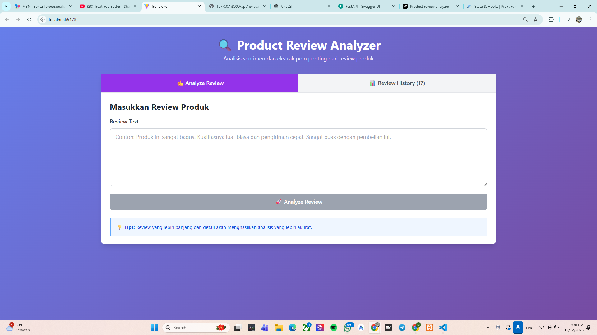

# Product Review Analyzer

Tampilan

Ringkasan

- Aplikasi fullstack: FastAPI (backend) + React (frontend).
- Backend menyimpan review, menganalisis sentimen dan mengekstrak key points.
- Frontend mengirim review dan menampilkan history.

Prerequisites

- Python 3.8+
- Node.js 16+
- PostgreSQL (jika digunakan oleh `database.py`)

Quickstart — Backend

1. Masuk ke folder backend:
   - cd d:\Bisnis\tugas-posgre\backend
2. Buat virtualenv dan install:
   - python -m venv .venv
   - .venv\Scripts\activate (Windows) atau source .venv/bin/activate (Unix)
   - pip install -r requirements.txt
3. Jalankan server:
   - uvicorn main:app --reload --host 127.0.0.1 --port 8000

Quickstart — Frontend

1. Masuk ke folder frontend:
   - cd d:\Bisnis\tugas-posgre\Front-end
2. Install dan jalankan:
   - npm install
   - npm run dev
3. Buka di browser (default) http://localhost:3000 atau sesuai dev server.

API Endpoints

- POST /api/analyze-review
  - Body JSON: { "text": "review Anda..." }
  - Mengembalikan objek review yang disimpan.
- GET /api/reviews
  - Mengembalikan array review.

Catatan penting

- Frontend mengirim field `text` pada POST (schema backend: ReviewCreate.text).
- services/api.js sudah menggunakan BASE URL: `http://127.0.0.1:8000/api`.
- App.jsx mengurutkan reviews terbaru di atas (id descending).
- ReviewCard menerima `text` atau fallback `review_text`; keypoints `keypoints` atau `key_points`.

Troubleshooting singkat

- CORS: Pastikan backend mengizinkan origin frontend (lihat middleware CORSMiddleware di main.py).
- Jika 404/500, cek logs backend (uvicorn) untuk error detail.
- Jika frontend tidak menemukan API, pastikan API_BASE_URL sesuai host:port backend.
- Periksa network tab di browser devtools untuk request/responses.

Kontak / Catatan

- Restart backend & frontend setelah perubahan.
- Sesuaikan allow_origins di backend jika menggunakan alamat berbeda.
